# 🌟 viper xmd 🚀

[](https://whatsapp.com/channel/0029Vb6H6jF9hXEzZFlD6F3d)

---

## � Quick Deploy

Deploy viper xmd to Heroku with one click:

[](https://heroku.com/deploy?template=https://github.com/ARNOLDT20/viper2)

---

## �📊 Profile Overview

👤 **Developer**: [BLAZE TECH](https://github.com/ARNOLDT20)  
📊 **Profile Views**:  


📈 **GitHub Stats (fallback badges)**:  
[](https://github.com/ARNOLDT20)
[](https://github.com/ARNOLDT20)

📈 **Contributions Graph (alternative)**:  


<p align="center">
	<a href="https://whatsapp.com/channel/0029Vb6H6jF9hXEzZFlD6F3d">
		
	</a>
</p>

<p align="center">
	<strong style="font-size:20px">viper xmd</strong>
</p>

<p align="center">
	<!-- Badges -->
	
	
	<a href="https://github.com/ARNOLDT20"></a>
</p>

---

## 📊 Profile Overview

👤 **Developer**: [BLAZE TECH](https://github.com/ARNOLDT20)

<p align="center">
	
</p>

---

## 🎯 Features

| Core | Auto | Moderation | AI |
|---|---|---|---|
| 🤖 Dual Mode (Groups & DMs) | 🔁 Auto-react & Auto-read | 🔒 Anti-call & Anti-delete | 🧠 GPT Chatbot |
| ⚙️ Configurable Commands | ⏱️ Typing/Presence helpers | 👑 Owner-only controls | 💬 Private Chat AI |

---

## 🚀 Quick Start

Clone and start locally:

```bash
git clone https://github.com/ARNOLDT20/Viper2.git
cd Viper2
npm install
npm run start
```

Run with Docker (example):

```bash
docker build -t viper-22:latest .
docker run -e SESSION_ID=your_session_id -d viper-22:latest
```

---

## 💡 Useful Commands

- `.chatbot on|off` — Enable/disable AI chatbot in private chats
- `.gpt <message>` — Get GPT response (manual)
- `.voicenote on|off` — Enable/disable voice note auto-reply (groups only)
- `.kick [@user]` — Remove a user from group with remover.gif (admin only)
- `.motivation` — Send a motivational image (aliases: `.motivate`, `.inspire`, `.quote`)
- `.uptime` — Show bot uptime
- `.mode public|private|toggle` — Change bot mode

---

## 🤖 AI Chatbot Feature

The Viper XMD bot includes a powerful AI chatbot that can respond to messages in private chats using GPT technology.

### How to Use:
1. **Enable Chatbot**: Send `.chatbot on` in a private chat to enable automatic responses
2. **Chat**: Once enabled, the bot will automatically respond to all your messages in that private chat
3. **Disable Chatbot**: Send `.chatbot off` to disable automatic responses
4. **Check Status**: Send `.chatbot` to see current status

### Features:
- ✅ Works only in private chats (DMs)
- ✅ Fetches real responses from GPT API
- ✅ Rate-limited to prevent spam (3-second minimum delay)
- ✅ Persistent settings per user
- ✅ Manual GPT queries with `.gpt <message>` command

### Example Usage:
```
User: .chatbot on
Bot: ✅ Chatbot has been enabled for this chat. I will now respond to your messages automatically!

User: Hello, how are you?
Bot: [GPT Response] Hello! I'm doing well, thank you for asking. How can I help you today?
```

---

## 🎙️ Voice Note Auto-Reply Feature

The bot includes an automatic voice note response feature that works in groups. When enabled, the bot will reply to all voice notes with random sticker GIFs from the media folder.

### How to Use:
1. **Enable Voice Note Reply**: Send `.voicenote on` in a group (admin only)
2. **Send Voice Notes**: Members can send voice notes in the group
3. **Auto Reply**: The bot will automatically reply with a random sticker GIF
4. **Disable**: Send `.voicenote off` to disable this feature
5. **Check Status**: Send `.voicenote` to see current status

### Features:
- ✅ Works only in groups
- ✅ Admin-only command to enable/disable
- ✅ Random sticker GIFs from media folder
- ✅ Persistent settings per group
- ✅ Smooth sticker conversion

### Example Usage:
```
Admin: .voicenote on
Bot: ✅ Voice note auto-reply has been enabled. The bot will now respond to voice notes with stickers!

[User sends a voice note]
Bot: [Sends a random sticker GIF]

Admin: .voicenote off
Bot: ✅ Voice note auto-reply has been disabled.
```

---

## 🛠️ Deployment

See `README_DEPLOY_KATABUMP.md` for Docker / Kubernetes / platform steps. Set required env vars like `SESSION_ID` before starting the bot.

---

## 🤝 Contributing

1. Fork the repository
2. Create a feature branch
3. Commit and open a Pull Request

---

## 📢 Community & Support

Join the WhatsApp channel for updates: [Join Now](https://whatsapp.com/channel/0029Vb6H6jF9hXEzZFlD6F3d)
---

## 📲 Download APK

📁 **Download APK**: [Fredi.AI v2.9.9](https://www.mediafire.com/file/chyvv2mktqc9jsv/fredi.ai.v2.9.9.apk)  
<details><summary>Installation Steps</summary>
1. Download the APK file  
2. Enable "Install from unknown sources" in your device settings  
3. Install the APK  
4. Open the app and follow in-app instructions  
</details>

---

## 📄 Changelog

- **Version 5.0.9**: Improved UI, added tap-to-interact feature, enhanced platform support, and updated setup guide for clarity.

---

## 🤝 Contribution Guidelines

Contributions are welcome! If you'd like to contribute, please fork the repository and submit a pull request. Ensure your changes are well-documented and follow the project's coding standards.

---

## 🙏 Acknowledgments

- Special thanks to all contributors who have helped shape this project.
- Gratitude to the open-source community for their invaluable support.


